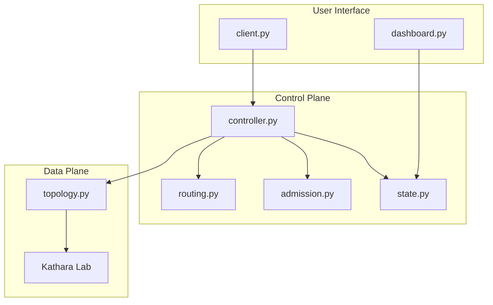

# Network Slicing in SDN

**Next Generation Networks, A.Y. 2025/2026**
Mirko Lana, Mattia Zagatti

An SDN network slicing controller built on Kathara and os-ken. It reserves bandwidth on a multi-link topology, preempts lower-priority flows when capacity is tight, and reroutes around failures, all driven through an interactive web dashboard.

## Architecture



- `state.py` tracks flows and residual capacity. Only mutator.
- `routing.py` widest-path and shortest-path algorithms.
- `admission.py` decides admit, reject, or preempt. Never mutates state.
- `controller.py` translates decisions into OpenFlow flow mods.
- `dashboard.py` live web UI on port 8080.

## Features

- **Widest-path routing**: selects the path with highest bottleneck residual capacity.
- **Priority-based preemption**: higher-priority flows can reclaim capacity from lower-priority ones.
- **TTL-based resource release**: flows expire automatically.
- **Reactive rerouting**: reroutes victims after link failure or preemption.
- **Interactive dashboard**: real-time network view at http://127.0.0.1:8080.
- **iperf3 validation**: throughput measurements with and without admission control.

## Quick Start

```bash
# requires Python 3.11 (pyenv or Homebrew)
./setup.sh

# start controller + deploy lab
.venv/bin/python -m netslice.topology start

# open dashboard
open http://127.0.0.1:8080

# stop everything
.venv/bin/python -m netslice.topology stop
```

## Client CLI

```bash
.venv/bin/python -m netslice.client add h1 h4 5 --priority 2
.venv/bin/python -m netslice.client flows
.venv/bin/python -m netslice.client links
.venv/bin/python -m netslice.client remove f3
```

## Demos

```bash
# run all five
.venv/bin/python -m netslice.demo

# run specific demo
.venv/bin/python -m netslice.demo 3

# list available demos
.venv/bin/python -m netslice.demo list
```

| # | Demo | What it shows |
|---|---|---|
| 1 | Admission control | admit/reject based on residual capacity |
| 2 | Widest path | path selection with max-bottleneck |
| 3 | Preemption | low-priority flow replaced by high-priority |
| 4 | TTL expiry | automatic resource release |
| 5 | Rerouting | victim flows rerouted after failure |

## Tech Stack

| Component | Technology |
|---|---|
| Network emulator | Kathara 3.8.3 |
| Controller | os-ken 4.2.1 (OpenFlow 1.3) |
| Language | Python 3.11 |
| Traffic gen | iperf3 |
| Topology shaping | `tc` (traffic control) |
